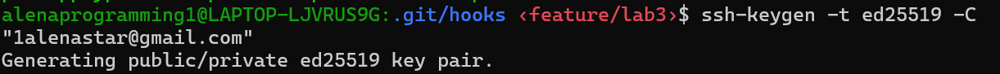
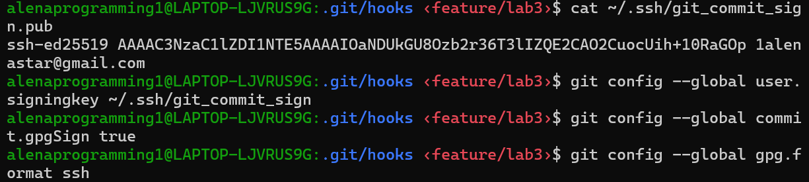

# Lab 3 — Secure Git: Submission

## Task 1: SSH Commit Signature Verification

### 1.1: Research Summary - Commit Signing Benefits

Commit signing is a critical security practice in DevSecOps workflows that provides:

#### **Authentication & Integrity**
Signed commits mathematically prove that you (the key holder) authored the commit. This prevents impersonation attacks where:
- Adversaries configure Git with `user.name = "Your Name"` and create fraudulent commits
- Without signing, nothing prevents malicious commits appearing to come from developers
- SSH signatures embed cryptographic proof tied to your private key

#### **Supply Chain Security**
- **Prevents GitHub Spoofing:** Attackers cannot forge commits even with repository access
- **CI/CD Trust:** Automated systems can verify commit origin before executing workflows
- **Code Review Authenticity:** Reviewers can trust who actually approved merge commits
- **Compliance & Auditing:** Organizations can enforce signed commits in policy and maintain audit trails

#### **DevSecOps Context**
- Infrastructure-as-Code (IaC) commits signed and verified prevent unauthorized infrastructure changes
- Security policy changes (firewall rules, IAM) must be attributed to specific authenticated users
- Hack detection: Verified badges on commits identify timeline of compromised accounts
- Incident response: Quickly identify which commits came from a compromised account

### 1.2: SSH Configuration Process

**Steps implemented:**

1. **SSH Key Configuration:**
   - Generated a new Ed25519 key
   
   - Configured Git with the key path for signing

2. **Git Global Configuration:**
   ```
   git config --global user.signingkey <SSH_KEY_PATH>
   git config --global commit.gpgSign true
   git config --global gpg.format ssh
   ```
   

3. **Verification:**
   All commits in the `feature/lab3` branch are cryptographically signed with SSH

### 1.3: Signed Commit Evidence

